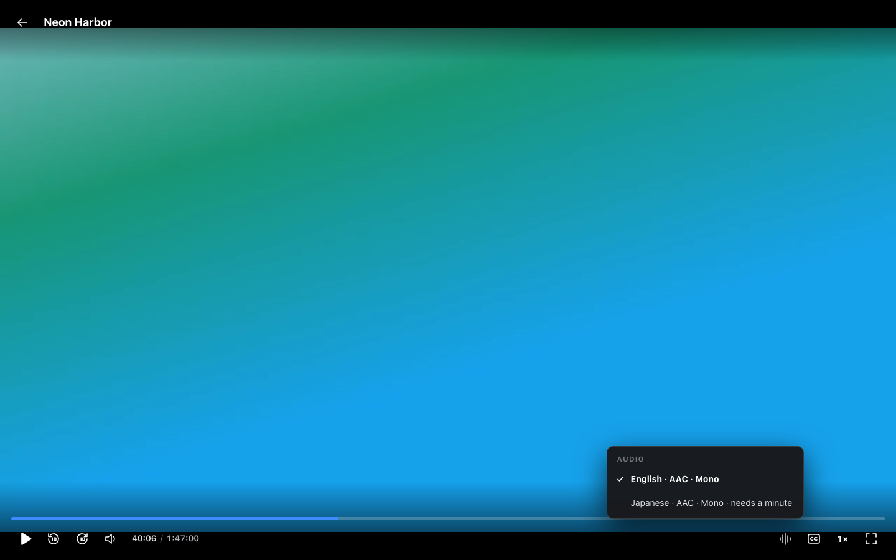
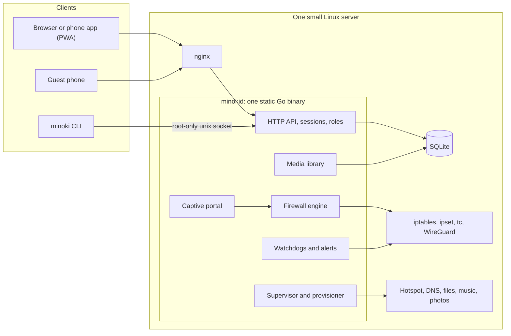

# Minoki Server Manager

A Go daemon, a command-line tool and a web console that turns a small Linux server into a Wi-Fi gateway with a guest login page, a VPN, a DNS level AdBlock, monitoring, a network astorage and video library.

This repository is a showcase of the project, holding screenshots, diagrams and write-ups. The source code is private and available for review on request (Please refer to contact details at the bottom). The data in screenshots are made up for privacy.

Live demo: https://c1.yashjswl.com

## Why I built it

The first version of this server was a set of PHP pages that ran `sudo` on bash scripts. Those scripts looked after the hotspot, the guest login, the firewall, the VPN and a few self-hosted apps. The system worked but passwords and a PIN were stored in the code, nothing was tested, and each change meant guessing what a script would do to the firewall.

This tool replaces the old system with a single program that owns the firewall and everything around it, with one authenticated API in front.
It runs in production on an old 32-bit Ubuntu 18.04 machine, on a Core 2 Duo with 4 GB of RAM. This limitation shaped many of the choices described below.

## What it does

It shares an internet connection with devices on its own hotspot and manages access.

- It builds the firewall rules and loads them in one step. You can block a device, limit its speed, or switch all sharing off with one master switch.
- Guests see a sign-in page. Phones are redirected so their own login sheet opens. The admin can keep several four-digit codes at once and see how often each one is used.
- WireGuard VPN with a watchdog, and switching between a Wi-Fi uplink and a wired one. It also notices when the uplink is behind a login page of its own, which a simple ping would call "online".
- Live monitoring: traffic per interface, busiest processes, system meters, service health and an activity feed. Alerts play recorded sounds, in English or Japanese.
- The hotspot can run on the 2.4 or 5 GHz band, and each network adapter can be switched on or off from the console.
- A provisioner that installs about fifteen supporting services, adopts ones that already exist instead of overwriting them, and can take over from the old setup with a rollback.
- A video library with posters, series, resume, subtitles, a choice of audio tracks, and one-time repackaging of MKV files so browsers can play them.
- Two consoles behind one login: the full admin console, and a restricted one for users.
- Installable phone apps. The console and the video library are separate progressive web apps (PWA).

## Tech Stack & Development Processes

- Backend and API design in Go: one daemon, a role-checked HTTP API with 86 documented routes, SQLite storage, and migrations that run on their own at startup.
- Linux and networking: iptables, ipset and tc, a captive portal, WireGuard, hostapd, dnsmasq and systemd.
- Security: hashed passwords and tokens, attempt limits, deny-by-default roles, and password re-confirmation for sensitive changes.
- Front end: a plain JavaScript console with light and dark themes, separate desktop and phone layouts, and installable apps.
- Testing: 273 passing tests, including golden-file tests for the generated firewall rules.
- Operations: dry runs, backups, a staged cutover with automatic rollback, service supervision and health reports.

## Safety Measures

As the source isn't here to run, how the system is looked after is described below.

Anything that touches the machine has a dry run first. Provisioning prints its plan. Migration shows what it would import. Cutover has a preflight step.

Cutover takes backups, checks each step, and rolls itself back if it isn't confirmed within a few minutes. That lets me change a live gateway over SSH without worrying about locking myself out.

The daemon owns its own firewall chains and loads them in a single `iptables-restore`, so applying them twice changes nothing. If the daemon restarts, it reapplies everything from its database.

## Screenshots

| | |
|---|---|
|  |  |
| Clients, with block and speed limit | Network: uplink, sharing, adapters |
|  |  |
| Hotspot band and channel, guest access codes | User management |
|  |  |
| Services and their health | System meters and power |
|  |  |
| Alerts, in English or Japanese | Blocked connections |

The video library:

| | |
|---|---|
|  |  |
| Home, with continue watching | A series and its episodes |
|  |  |
| Player, with subtitle timing | Edit, hide and regroup |
|  | |
| Choosing between audio tracks | |

Dark theme, phone layouts and the guest portal:

| | | | |
|---|---|---|---|
|  |  |  |  |
| Dark | Phone | Phone videos | Guest portal |

The user console is the same app with fewer pages and none of the admin tools:

| | | | |
|---|---|---|---|
|  |  |  |  |
| Overview | Services | Videos | Phone |

The console also documents itself, including every HTTP endpoint with examples.

## Architecture

There's a longer explanation in [docs/ARCHITECTURE.md](docs/ARCHITECTURE.md).

## Design decisions

The firewall is never left half-applied. Rules go into chains the program owns and load in one `iptables-restore`. If loading fails, the previous rules stay in place. Golden-file tests cover the generated rules.

Roles are deny-by-default. A user account can call a short list of routes and nothing else, so a new admin route is closed to users from the moment it exists. A test sends dozens of requests with a user's token and expects a refusal for every route that isn't on the list. The console hides what a user can't use and the server refuses the same.

Sensitive changes ask for the admin password again, even when you're already signed in. Creating or deleting a guest code or a user works this way, with its own attempt limit.

Auto-launch captive portal on phones. The server sends an unauthorised guest's plain-HTTP traffic to the portal, and after sign-in it sends the phone back to that address so the sheet can close.

On a Core 2 Duo, transcoding video isn't realistic. So the library repackages MKV to MP4 once, in the background, at the lowest priority, and keeps the result. The binaries are static with no libc dependency, so the old distribution's libraries don't get in the way.

The hotspot band can be changed from the console. The change rewrites only the band and channel in the hotspot's configuration and restarts it. If the radio doesn't come up on the new band, the previous settings are restored automatically.

An MKV with several audio tracks (for example Japanese and English) keeps the first one in the repackaged video. The others are extracted on demand into small audio files, and the player plays the chosen one beside the muted video, kept in step with it. Browsers can't switch audio tracks inside an MP4 reliably, and a second full copy of the video per language would take gigabytes.

Age-gated categories are refused by every route that could expose them (titles, artwork, subtitles, files and direct links) until a session confirms its age. The protection lives on the server, not in the interface.

### Bugs faced during development

- A progress bar stuck at 0%. The server's older ffmpeg reports elapsed time under a different key than newer versions.
- A console that wouldn't start after an update, because the browser paired a new script with a cached old one. The server now asks browsers to revalidate on every load.
- An nginx directive that isn't allowed inside `if`. I caught it by testing the configuration before reloading it.
- 5 GHz was refused by the hotspot adapter on every channel. The cause was a signature check: the updated wireless regulatory database was signed with a newer key than the old `crda` tool trusts, so the country settings never applied. A driver option fixed it.
- A progress bar stuck at 99%. It turned out to be a final pass of several minutes over a 1.5 GB file, so the player now says "Finishing up".

## The numbers

| | |
|---|---|
| Go source | about 18,100 lines, 2 programs, 16 internal packages |
| Go tests | about 8,100 lines, 273 passing |
| Console JavaScript | about 4,200 lines, no framework |
| HTTP API | 86 documented endpoints, all authenticated and role-checked |
| Runs on | 32-bit Ubuntu 18.04 in production |
| Dependencies | Go standard library, a pure-Go SQLite driver, bcrypt |

## Stack Summary

Go, SQLite, iptables, ipset, tc, WireGuard, hostapd, dnsmasq, nginx, ffmpeg and systemd. The front end is plain JavaScript and CSS, delivered as progressive web apps.

## Read next

- [Feature tour](docs/FEATURES.md)
- [Architecture](docs/ARCHITECTURE.md)
- [Security design](docs/SECURITY.md)
- [API overview](docs/API-OVERVIEW.md)

## Contact

From [Yashasvi Jaiswal](https://yashjswl.com). Source code is available for review on request.

LinkedIn: [linkedin.com/in/yashjswl](https://www.linkedin.com/in/yashjswl/)

Email: [hello@yashjswl.com](mailto:hello@yashjswl.com)

---

&copy; 2026 Yashasvi Jaiswal. All rights reserved.
