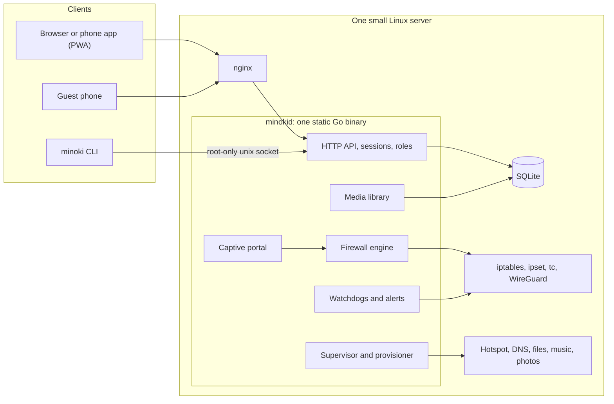

# Minoki Server Manager

**A Wi-Fi gateway, captive portal, VPN and self-hosted-cloud control plane for one small Linux server.**
One static Go daemon, a command-line tool, and a full web console that installs on a phone like a native app.

> **About this repository.** This is a showcase of a private project: write-ups, diagrams and screenshots only.
> The source code is not published and is not licensed for reuse (see [LICENSE](LICENSE)).
> It is available to recruiters and engineers on request, for evaluation. All names, devices, addresses and videos in
> the screenshots are invented sample data.

---

## The problem

The first version of this server was a set of PHP pages that called `sudo` on bash scripts to run a hotspot, a guest
login page, a firewall, a VPN and a few self-hosted apps. Secrets lived in the code, nothing was tested, and nobody could
change it safely.

Minoki Server Manager replaces all of that with one program you can reason about. It owns the firewall, the guest
portal, the VPN, monitoring, service health and a video library, exposes everything through one authenticated API,
and ships a console designed like professional network software.

It runs in production on a **32-bit Ubuntu 18.04 machine** (a Core 2 Duo with 2 GB of RAM), which shaped many of the
engineering decisions below.

## What it does

| Area | Highlights |
|---|---|
| **Gateway and firewall** | Declarative rules applied atomically, so the firewall is never half-configured. Per-device block and speed limits, a master kill switch, a WAN shield, and trusted-peer rules tied to interface, address and MAC together. |
| **Captive portal** | Guests enter an access code before they get internet. Unauthorised devices are redirected so the sign-in sheet is meant to open by itself (it follows the probe addresses iOS, Android and Windows use). Several four-digit codes, per-code usage, sessions that expire, and admin-password re-confirmation for changes. |
| **VPN and uplink** | WireGuard on/off with a watchdog, switchable Wi-Fi or wired uplink, and detection of hotspot login walls that fool a simple ping. |
| **Monitoring and alerts** | Live throughput, top applications, system meters, an activity feed, a service doctor, and spoken or audible alerts for power, VPN and intrusion events. |
| **Provisioning** | Installs and configures about fifteen services idempotently, adopts what is already installed instead of overwriting it, and migrates from the old stack with a staged, reversible cutover and automatic rollback. |
| **Video library** | A streaming-style library with posters, series, resume, subtitles (embedded, sidecar and searched online), and one-time repackaging of MKV files so browsers can play them. |
| **Two consoles** | An administrator console and a smaller **user console** (Overview, Services, Videos, Settings) behind the same login, enforced on the server. |
| **Installable apps** | The console and the Video library are separate installable PWAs with their own icons. |

## Screenshots

| | |
|---|---|
|  |  |
| **Clients:** every device, with block and speed limit | **Network:** uplink, sharing, speed test |
|  |  |
| **Guest access codes:** several codes, each with usage | **User management:** create sign-ins, reset, delete |
|  |  |
| **Services:** the self-hosted apps and their health | **System:** meters, disks, interfaces, power |
|  |  |
| **Alerts and sound:** spoken and audible alerts | **Logs:** blocked connections, filterable |

### The video library

| | |
|---|---|
|  |  |
| **Library:** continue watching, rows, search | **Series:** episodes, progress, watched marks |
|  |  |
| **Player:** subtitles with timing adjustment | **Manage:** edit, hide, regroup, bulk actions |

### Light, dark and phone

| | | | |
|---|---|---|---|
|  |  |  |  |
| Dark theme | Phone layout | Phone video library | Guest portal on a phone |

### The user console

The same app and the same look, with a smaller set of pages and none of the administrator's tools:

| | | | |
|---|---|---|---|
|  |  |  |  |
| Overview | Services (five apps) | Videos (watching only) | On a phone |

### Documentation inside the product

The console contains its own documentation page (guide, command-line reference, settings, and every HTTP endpoint with
examples). A script checks that no endpoint is left undocumented.

## Architecture

More detail in [docs/ARCHITECTURE.md](docs/ARCHITECTURE.md).

## Engineering decisions worth reading about

- **The firewall is applied atomically.** Rules live in chains the program owns and are loaded in one
  `iptables-restore`, so a failure cannot leave the machine half-configured. The generated rules are covered by
  golden-file tests, and applying them twice is a no-op.
- **Roles are deny-by-default.** A "user" account may call a short allow-list of routes and nothing else, so a new
  administrator route is safe the moment it exists. A test walks dozens of routes, existing and not, to prove it. The console hides what a
  user cannot use, but the server is what actually refuses.
- **Sensitive actions re-ask for the password.** Creating or deleting a guest code or a user needs the
  administrator's password again, with a separate attempt limit, even when already signed in.
- **Captive-portal detection that really works.** Phones decide whether to open a login sheet by probing a known web
  address. The server redirects unauthorised guests' plain-HTTP traffic to the portal, and after sign-in sends the phone
  back to the probe address so the sheet closes by itself.
- **Takeover without downtime.** A staged cutover from the old system takes backups, verifies each step, and rolls back
  automatically if you do not confirm in time.
- **Built for a tiny machine.** Static, CGO-free binaries (no libc dependency); heavy jobs run at the lowest CPU and disk
  priority, one at a time. Rather than transcode video on an old CPU, the library remuxes to MP4 once and caches it.
- **Server-side age gating.** Restricted categories are refused by every route (titles, artwork, subtitles, files, direct
  links) until a session confirms its age. Hiding them in the UI is never the only protection.
- **A console with no build step.** Plain ES modules, a token-based design system with light and dark themes, an
  authored icon set, and different layouts for desktop and phone. No framework, no bundler, no CDN requests.

### Bugs that taught me something

- A progress bar stuck at **0%**: the server's older ffmpeg reports time under a different key than newer versions.
- A console that **would not start after an update**: the browser paired a new script with a cached old one. The fix was
  making the server ask browsers to revalidate on every load.
- A nginx directive that **is not allowed inside `if`**, found by testing a config before reloading it.
- A **99%** that was really a minutes-long final pass over a 1.5 GB file, now shown as "Finishing up".

## By the numbers

| | |
|---|---|
| Go source | about 17,400 lines, in 2 programs and 16 internal packages |
| Go tests | about 7,700 lines, **266 passing tests** |
| Console (JavaScript) | about 4,100 lines, no framework |
| HTTP API | **81 documented endpoints**, authenticated and role-checked |
| Runs on | 32-bit Ubuntu 18.04 in production; builds as a static binary for other Linux targets |
| Dependencies | Go standard library, a pure-Go SQLite driver, bcrypt |

## Tech

Go · SQLite · iptables, ipset and tc · WireGuard · hostapd and dnsmasq · nginx · ffmpeg · systemd ·
JavaScript (ES modules), CSS custom properties · Progressive Web Apps · headless Chrome for visual testing.

## Where to go next

1. [docs/FEATURES.md](docs/FEATURES.md): a guided tour of every area.
2. [docs/ARCHITECTURE.md](docs/ARCHITECTURE.md): how the pieces fit, with diagrams.
3. [docs/SECURITY.md](docs/SECURITY.md): the threat model and the controls.
4. [docs/API-OVERVIEW.md](docs/API-OVERVIEW.md): the shape of the HTTP API.

## Contact

Built by **[yashjswl](https://github.com/yashjswl)**. Source code is available for review on request.

---

&copy; 2026 Yashasvi Jaiswal. All rights reserved.
