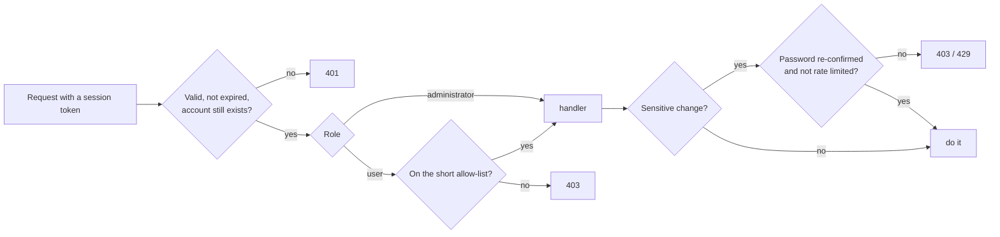

# Architecture

The system has one root daemon (`minokid`), one command-line tool (`minoki`) and a static web console served by nginx. The console reads and changes everything through the daemon's HTTP API, and nothing else touches the system.

## The shape of it


## What each piece does

| Piece | Job |
|---|---|
| Firewall engine | Takes the desired state (sharing, portal, VPN, blocked devices, trusted peers), builds one rule set for the chains it owns, loads it in one go, and reapplies it after a reboot or a firewall restart. |
| Captive portal | Checks access codes (rate limited), finds a guest's MAC address from the neighbour table, adds it to a timed allow-list, and tells tunnel visitors apart from hotspot guests. |
| Media library | Scans a folder, probes files, works out how each plays in a browser, repackages MKV in the background, finds posters and subtitles, and serves video with range requests. |
| Provisioner | Installs and configures supporting services in dependency order. It adopts what's already there, backs up any file it rewrites, and offers a dry run. |
| Cutover | Takes over from the old system in steps: preflight, apply, confirm. If it isn't confirmed in time, it rolls back. |
| Supervisor | Watches every managed service and restarts failures with backoff. It also feeds the "doctor" report. |
| Watchdogs and alerts | Keep the hotspot radio and the VPN up, spot attacks in the firewall log, and announce events out loud. |
| Auth and roles | Hashed passwords and session tokens, two roles, deny-by-default route access and attempt limits. |

## A guest joins the hotspot

```mermaid
sequenceDiagram
  participant P as Guest phone
  participant FW as Firewall
  participant N as nginx
  participant D as minokid
  P->>FW: HTTP request to the OS probe address
  FW->>N: redirected here (device not yet authorised)
  N-->>P: 302 to the portal page
  P->>D: shows the page, guest types the code
  D->>D: verify code, find the phone's MAC
  D->>FW: add MAC to the timed allow-list
  D-->>P: success; page loads the probe address
  P->>FW: probe now goes to the real internet
  Note over P: the OS sees "Success" and closes the sheet
```

## How every request is checked



## Data

One SQLite file holds settings, devices, accounts, sessions, access codes, the media index, per-user watch progress and the hand edits people make to the library. Hand edits live in their own tables, so a rescan never undoes them and the media files are never modified.

The database upgrades itself when the daemon starts, so an update is simply: replace the program and restart it.

## Why a daemon and not scripts

With scripts, each one changes a small part of the firewall, and it's hard to say what the sum looks like. A daemon decides the whole state in one place.

Every action is a validated API call with tests, instead of a web page building a shell command. The daemon can also check itself, through dry runs, health reports and rollbacks.
