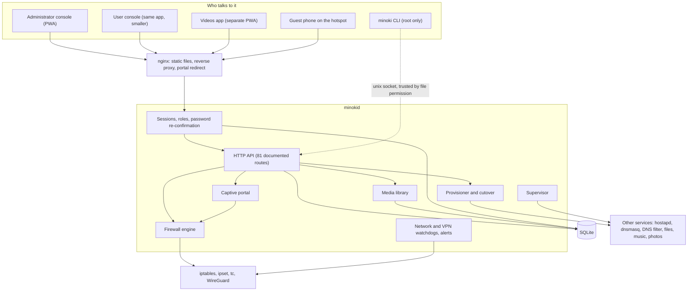
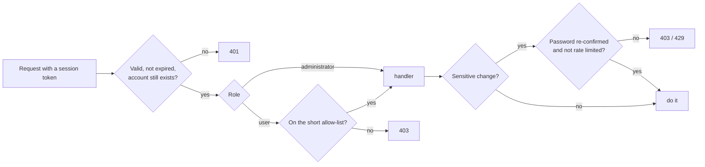

# Architecture

Minoki Server Manager is one root daemon (`minokid`), one command-line tool (`minoki`) and a static web console served
by nginx. Everything the console shows and every change it makes goes through the daemon's HTTP API.

## Shape of the system



## The pieces

| Piece | Responsibility |
|---|---|
| **Firewall engine** | Turns the desired state (sharing, portal, VPN, blocked devices, trusted peers) into one rule set for chains the program owns, loads it atomically, and re-applies it after a reboot or a firewall restart. |
| **Captive portal** | Verifies access codes (rate limited), looks up a guest's MAC address from the neighbour table, admits it to a timed allow-list, and tells tunnel visitors apart from hotspot guests. |
| **Media library** | Scans a folder, probes files, decides how each one can be played in a browser, repackages MKV once in the background, finds posters and subtitles, and serves video with range requests. |
| **Provisioner** | Installs and configures supporting services in dependency order, adopts services that already exist, backs up any file it rewrites, and can verify itself with a dry run. |
| **Cutover** | The staged takeover from the old system: preflight, apply, confirm, and an automatic rollback if it is not confirmed in time. |
| **Supervisor** | Watches every managed service and restarts failures with backoff. Feeds the "doctor" report. |
| **Watchdogs and alerts** | Keep the hotspot radio and the VPN healthy, notice attacks in the firewall log, and announce events out loud. |
| **Auth and roles** | Hashed passwords and session tokens, two roles, deny-by-default route access, and attempt limits. |

## A guest joins the hotspot

```mermaid
sequenceDiagram
  participant P as Guest phone
  participant FW as Firewall
  participant N as nginx
  participant D as minokid
  P->>FW: HTTP request to the OS probe address
  FW->>N: redirected here (device not yet authorised)
  N-->>P: 302 to the portal page
  P->>D: shows the page, guest types the code
  D->>D: verify code, find the phone's MAC
  D->>FW: add MAC to the timed allow-list
  D-->>P: success; page loads the probe address
  P->>FW: probe now goes to the real internet
  Note over P: the OS sees "Success" and closes the sheet
```

## A request is checked twice



## Data

A single SQLite database holds settings, devices, accounts, sessions, access codes, the media index, per-user watch
progress and hand-made library edits. Hand edits live in their own tables, so a rescan never undoes them and the media
files themselves are never modified. The database upgrades itself on start, so an update is "replace the program, restart".

## Why a daemon instead of scripts

- One place decides what the firewall should look like, instead of scripts that each change a little.
- Every action is a validated API call, with tests, instead of a web page building a shell command.
- It can verify itself: dry runs, health reports, and rollbacks.
