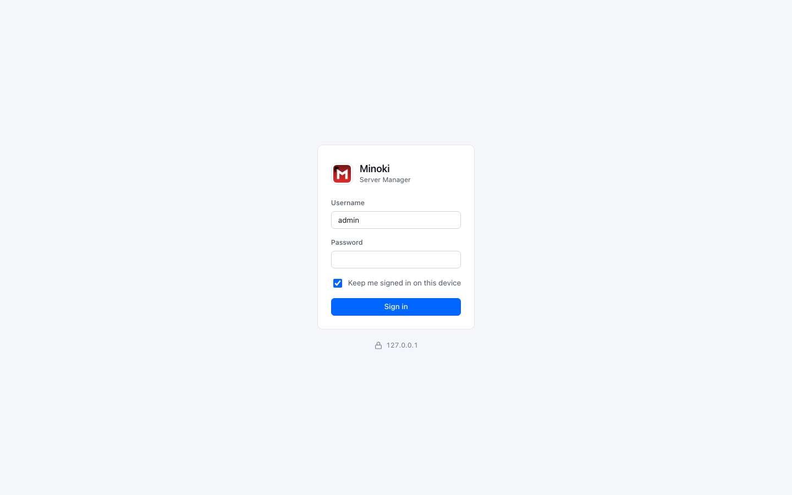
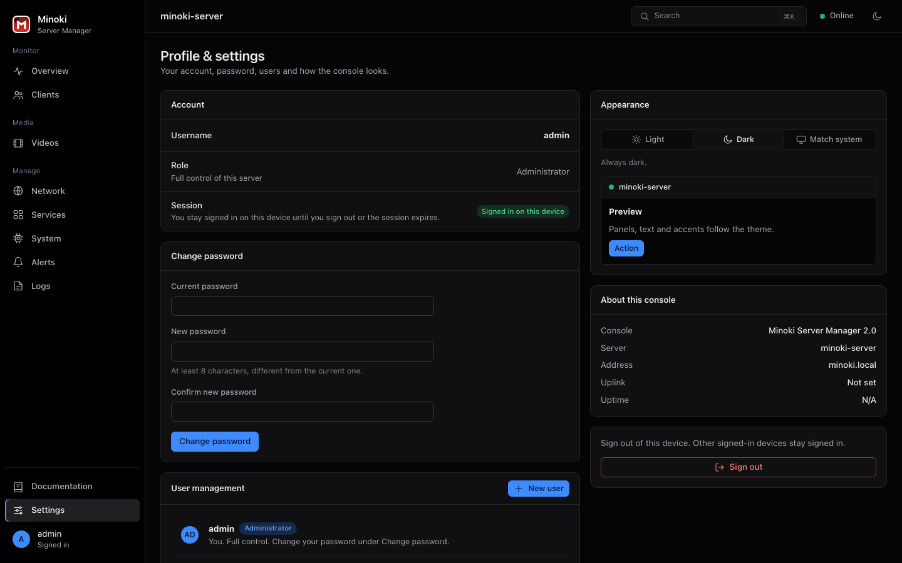

# Feature tour

A walk through the project, area by area. All screenshots use sample data I made up.

## 1. The gateway

The server shares one internet connection (Wi-Fi or a wired port) with the devices on its own hotspot.

Internet sharing is a single master switch. When it's off, the hotspot can't reach the internet at all, so it also works as a kill switch.

You can choose the uplink between the Wi-Fi and wired ports, scan for networks and connect. If the uplink Wi-Fi has a login page of its own, the console says so. A plain ping would report "online" in that case, which isn't quite true.

The hotspot can run on the 2.4 GHz or the 5 GHz band. 5 GHz is faster and avoids the crowded 2.4 GHz band, with a shorter range. The console restarts the hotspot on the new band and puts the previous settings back if the radio won't start on it. Each network adapter also has an on/off switch, and a switched-off adapter stays off after a restart.

For each device you can rename it, block it or limit its speed, and the limits survive a reboot.

Until a device signs in, it can reach DHCP, DNS and the web server, and nothing else. An optional uplink shield also drops unsolicited inbound traffic. It always leaves the management ports open, so it can't lock the administrator out.

## 2. The guest portal

Guests open any web page and land on a sign-in page. On phones, the operating system's own login sheet opens.

The administrator can keep several four-digit codes at once, for example one for family, one for a weekend and one for a workshop. Each shows how often it has been used and can be deleted at any time. Adding or deleting a code asks for the admin password again.

Sessions last for the time you choose, from 30 minutes to 24 hours. One button signs every guest out.

## 3. Monitoring and health

The Overview page shows the path to the internet (uplink, gateway, hotspot, clients) with the real health and live traffic of each link. Below that you'll find throughput, system meters, VPN state, clients, top applications and recent events.

The System page has per-resource detail, disks, interfaces and power actions that need a typed confirmation. Services lists the self-hosted apps with live status. Logs shows blocked connections, with a switch to hide routine chatter from other devices on the network.

Alerts play recorded sounds for power, VPN and intrusion events, in English or Japanese. Language and volume are adjustable, and the volume can go past the hardware maximum.

## 4. The video library

The library is built into the daemon and the console.

Folders become categories. A folder of episodes becomes a series, and loose files named like episodes are grouped into one automatically. Posters come from a movie database when a key is set, and from a frame of the video otherwise. Titles can be renamed, regrouped, hidden and renumbered without touching the files.

How a file plays depends on the file. If the browser can play it, it plays directly. Otherwise it's repackaged to MP4 once in the background, with a progress bar that also covers the slower final pass. If that isn't possible either, a link opens it in an external player.

Subtitles come from embedded streams, files next to the video, or an online search. A timing control helps when they're slightly out of sync. When a file has several audio tracks, an Audio menu lets you choose between them. The chosen track is prepared in the background while the video keeps playing, and then switches in. Watch progress is kept per user.

Restricted (A-rated) categories stay hidden until a session confirms its age, and the server enforces this.

## 5. Accounts and consoles

The administrator creates user accounts. A user signs in on the same page and gets a smaller console: an Overview without the admin tools, five apps under Services, Videos, and Settings. The server refuses everything else, whatever the page happens to show.

## 6. Installable apps

The console and the video library are separate progressive web apps. Each has its own icon, name and startup screen, so they sit on a phone's home screen like native apps. Desktop gets a sidebar and dense tables. Phones get a bottom bar, list rows and bottom sheets.

## 7. Operating it

Provisioning installs and configures the supporting services, adopts what's already installed, and backs up any file it rewrites. A dry run shows the plan first.

Cutover moves a live gateway over from the old system, with backups, a check after each step and an automatic rollback.

Doctor reports on every managed service, from the command line or from the console.

The documentation lives inside the product, and a small script checks that no route is left out.
